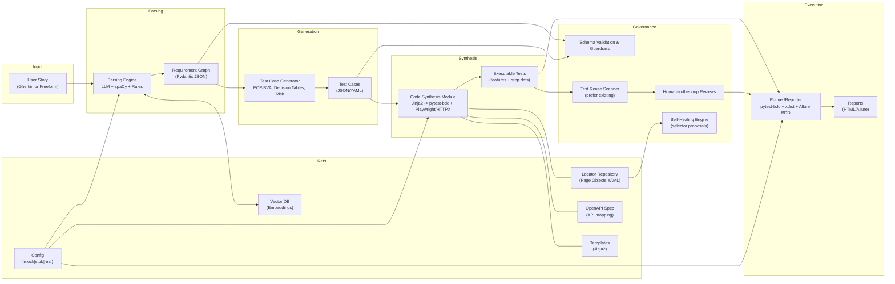
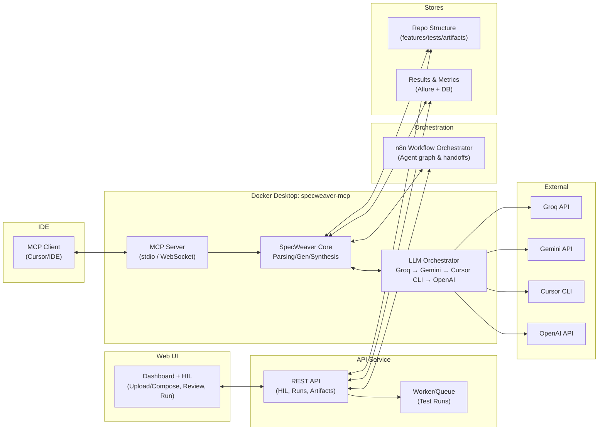

### High-Level Architecture

- Input: User story (freeform or Gherkin)
- Parsing Engine: LLM + spaCy + rules -> Requirement Graph
- Test Case Generator: decision tables, ECP/BVA, risk heuristics -> structured cases (JSON/YAML)
- Script Synthesis: Jinja2 templates -> pytest + Playwright tests
- Mapping: locator repo (UI) + OpenAPI (API)
- Data: Faker + constraints
- Runner/Reporter: pytest xdist + Allure/HTML

#### Architecture Diagram

#### Component Responsibilities

- Parsing Engine: Normalize story, extract acceptance criteria, produce a validated `RequirementGraph`.
- Test Case Generator: Expand graph to decision-table-driven cases with ECP/BVA and risk tagging.
- Code Synthesis Module: Resolve semantic actions to UI/API via locator repository and OpenAPI; render tests using Jinja2.
- Runner/Reporter: Execute tests with `pytest -n auto`; collect Allure/HTML reports.
- Governance: Schema validation, deterministic codegen, human review gates, drift detection.

#### Artifacts & Interfaces

- Inputs: user story (Markdown/Gherkin), `locator-repo.yml`, OpenAPI spec.
- Outputs: `artifacts/requirement_graph.json`, `artifacts/test_cases.json|yaml`, generated tests under `tests/`.
- Interfaces: prompt templates, JSON schemas, Jinja template variables, mapping repo format and resolution rules.

### MCP Integration (IDE-native)

This framework is exposed as an MCP server so it can be used directly from MCP-capable IDEs (e.g., Cursor) via standard tools.

Exposed MCP tools:
- `parse_requirement(story_md)` → `requirement_graph.json`
- `generate_test_cases(requirement_graph, coverage)` → `test_cases.json`
- `synthesize_scripts(test_cases, locator_repo)` → files under `tests/`
- `validate_artifacts(requirement_graph, test_cases)` → issues list
- `run_tests(pytest_args)` → report paths

Transport: stdio in local dev; WebSocket/HTTP bridge enabled from the Docker container for IDE connectivity.

### UI + API Responsibilities

- Web UI: Upload/enter requirements, show generated test proposals (HIL approval), trigger runs, and display dashboard metrics/trends.
- API Service: Endpoints for parse/generate/synthesize, approvals, run orchestration, artifact storage, and results ingestion.
- Queue/Workers: Execute long-running tasks (generation and test runs) and stream status to UI.
- Artifact Store: Persist requirement graphs, test cases, generated features/step defs/tests under the framework’s structure.
- Results Store: Ingest Allure/pytest results to power dashboard KPIs and trends.

