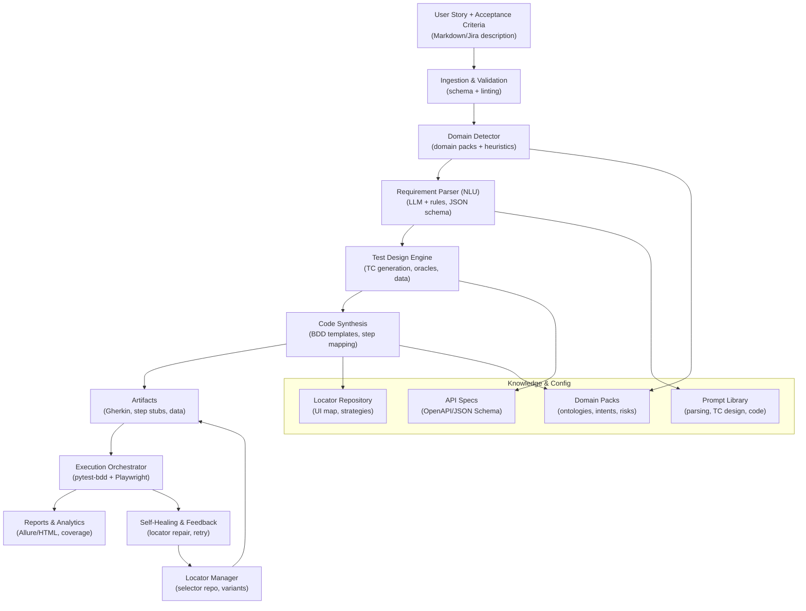

## Automated Generation of Functional Test Scripts from User Stories

### 1) Objective

- **Goal**: Automatically transform natural-language user stories into executable functional test scripts to reduce manual effort, increase coverage, and accelerate delivery.
- **Outcome**: Given a user story, the framework parses requirements, designs granular test cases, and synthesizes runnable automation (BDD feature files and step definitions) for a chosen application ecosystem.

### 2) Ecosystem Definition

- **Application domain**: E‑commerce
- **Sample application**: "Luma" — a modern online retail storefront supporting browsing, cart, checkout, and order management.
- **Technology target**:
  - Web UI: React + REST APIs (Node/Express)
  - Authentication: session/JWT
  - Payments: credit card gateway (mocked for tests)
  - Test automation: pytest-bdd + Playwright (Python)

### 3) High‑Level Architecture

The framework orchestrates NLU, test design, and code synthesis with strong separation of concerns and explicit knowledge sources (domain packs, locators, API specs).



Component boundaries and responsibilities:
- **Ingestion & Validation**: Accepts user stories (Jira, Markdown); validates format; standardizes input.
- **Domain Detector**: Infers domain to select domain pack (vocabulary, risks, intent patterns).
- **Requirement Parser (NLU)**: Extracts actors, intents, preconditions, flows, acceptance criteria; normalizes into a typed model.
- **Test Design Engine**: Expands into positive/negative/edge cases using patterns, risk catalogs, and combinatorics; assigns oracles.
- **Code Synthesis**: Maps steps to UI/API layers; renders BDD features and step definitions via templates.
- **Locator Manager**: Resolves logical elements to stable selectors; supports multi‑strategy and self‑healing.
- **Execution Orchestrator**: Runs pytest-bdd + Playwright; aggregates reports; triggers feedback loop.
- **Knowledge & Config**: Domain packs, locators, prompts, and API specs drive consistent, governed generation.

### 4) Solution Approach & Technical Design

#### 4.1 Requirement Parsing
- **Input assumptions**: User story in standard form with optional acceptance criteria.
  - Example structure:
    - As a <role>, I want <capability>, so that <benefit>.
    - Acceptance Criteria: bullets or Gherkin-like lines.
- **Preprocessing**: Normalize text (strip HTML/Markdown noise), sentence segmentation, bullet extraction.
- **NLU technique**: Hybrid approach:
  - Primary: LLM prompt with structured extraction (Pydantic/JSON schema) to produce `RequirementModel`.
  - Secondary: Rule-based + spaCy patterns for robustness and fallback.
- **Parsed output (typed)**:
  - `actors`, `intents`, `preconditions`, `main_flow`, `alt_flows`, `acceptance_criteria`, `non_functional`, `risks`, `test_data_hints`.

Example extraction schema for the LLM:

```json
{
  "title": "string",
  "actor": "string",
  "capability": "string",
  "benefit": "string",
  "preconditions": ["string"],
  "acceptanceCriteria": [
    {
      "id": "AC-1",
      "text": "string",
      "type": "functional|negative|edge",
      "inputs": {"field": "value"},
      "expected": "string"
    }
  ]
}
```

#### 4.2 Test Case Generation
- **Heuristic expansion**:
  - **Positive path** for each criterion.
  - **Negative cases**: invalid credentials, boundary values, required fields missing, forbidden actions.
  - **Edge cases**: empty cart, max quantity, network failovers, payment declines.
  - **Data variation**: pairwise or small combinatorial sets over critical fields.
- **Oracles**:
  - UI: visible text, URL changes, DOM state, toasts, accessibility roles.
  - API: HTTP codes, schemas (JSON Schema), idempotency, side effects.
- **Traceability**: `TC-<criterion>-<variant>` with links back to `AC` IDs for coverage tracking.

#### 4.3 Script Generation
- **Mapping**:
  - UI steps → `Locator Manager` resolves logical element names to selectors and fallback strategies.
  - API steps → OpenAPI endpoints/methods with example payloads derived from the model.
- **Templating**:
  - Jinja2 templates for:
    - `Feature` (Gherkin): professional Given/When/Then with proper indentation and tags placed above scenarios (no stray tags between scenarios) [[memory:5937573]].
    - `Step definitions`: pytest-bdd + Playwright, organized by domain (e.g., `tests/steps/checkout/`).
- **Test data**:
  - Factory methods with Faker; parameterized fixtures; data hooks per scenario outline.

#### 4.4 Maintainability & Scalability
- **Decoupled knowledge**: Domain packs and locator repositories are versioned and reusable across stories.
- **Self-healing selectors**: Multi-strategy (data-test-id, ARIA roles, text, structure); runtime repair with similarity scoring.
- **Prompt versioning**: Reproducible LLM prompts per model/temperature; fallbacks to rules for continuity.
- **Horizontal scale**: Async API + worker queue to fan out stories; caching (prompt + locator resolutions).
- **Change resilience**: Locator diffs and snapshot testing; fail-fast on breaking schema changes.
- **Governance**: PR gates for generated artifacts; coverage + flakiness budgets; tagged suites (smoke, regression).

### 5) Proposed Technology Stack

- **Language**: Python 3.11
  - Rich ecosystem for NLP, testing, templating; strong typing with Pydantic.
- **API & Workers**: FastAPI + Celery, Redis/RabbitMQ
  - Async ingestion; scalable background generation.
- **NLU**: OpenAI/compatible LLMs (via SDK) + spaCy rules
  - LLM for robust extraction; rules for determinism and cost control.
- **Modeling**: Pydantic
  - Validates structured outputs; versioned schemas.
- **Templating**: Jinja2
  - Clean separation of content and code; easy to retarget frameworks.
- **UI Automation**: Playwright (Python) + pytest-bdd
  - Reliable, fast browser automation with first-class async and cross-browser support.
- **API Testing**: requests/httpx + JSON Schema validation
  - Simple, effective contract checks.
- **Reporting**: Allure/pytest-html
  - Developer-friendly feedback and analytics.
- **Packaging/Runtime**: Docker Compose
  - Reproducible local execution and CI pipelines.

### 6) Proof of Concept (POC)

This POC takes a sample user story and produces:
1) Professional Gherkin feature(s) with correct Given/When/Then formatting and tags; 2) pytest-bdd step stubs ready to implement with Playwright. You can copy-paste and run locally.

#### 6.1 Sample User Story

As a registered shopper, I want to add a product to my cart and check out with a credit card so that I can place an order successfully.

Acceptance Criteria:
- AC-1: When I add an in-stock product to the cart, it appears in the cart with correct price and quantity.
- AC-2: When I provide a valid Visa card, the payment succeeds and I see an order confirmation number.
- AC-3: If I provide an invalid card number, the payment is declined and I see an error message without charging my card.

#### 6.2 Single-file POC Script (parser + generator)

Copy into a local file (for example `poc_autogen.py`) and run with `python poc_autogen.py`. It will print a Gherkin feature and step stubs that adhere to standard Given/When/Then format and proper tag placement [[memory:5937573]].

```python
from __future__ import annotations

from dataclasses import dataclass, field
from typing import List, Dict


@dataclass
class AcceptanceCriterion:
    id: str
    text: str
    type: str = "functional"  # functional|negative|edge


@dataclass
class Requirement:
    title: str
    actor: str
    capability: str
    benefit: str
    acceptance_criteria: List[AcceptanceCriterion] = field(default_factory=list)


SAMPLE_STORY = {
    "title": "Checkout with credit card",
    "actor": "registered shopper",
    "capability": "add a product to cart and check out with a credit card",
    "benefit": "place an order successfully",
    "acceptance_criteria": [
        {"id": "AC-1", "text": "When I add an in-stock product to the cart, it appears in the cart with correct price and quantity.", "type": "functional"},
        {"id": "AC-2", "text": "When I provide a valid Visa card, the payment succeeds and I see an order confirmation number.", "type": "functional"},
        {"id": "AC-3", "text": "If I provide an invalid card number, the payment is declined and I see an error message without charging my card.", "type": "negative"},
    ],
}


def parse_story(raw: Dict) -> Requirement:
    acs = [AcceptanceCriterion(**ac) for ac in raw["acceptance_criteria"]]
    return Requirement(
        title=raw["title"],
        actor=raw["actor"],
        capability=raw["capability"],
        benefit=raw["benefit"],
        acceptance_criteria=acs,
    )


def to_feature(requirement: Requirement) -> str:
    lines: List[str] = []
    # Top-level tags for suite organization
    lines.append("@e2e @checkout @specshop")
    lines.append(f"Feature: {requirement.title} - {requirement.capability}")
    lines.append("")
    for ac in requirement.acceptance_criteria:
        scenario_tag = "@positive" if ac.type != "negative" else "@negative"
        lines.append(f"{scenario_tag} @{ac.id.lower()}")
        # Create a scenario name that reflects the AC
        scenario_name = ac.text
        # Basic Given/When/Then scaffolding respecting professional Gherkin formatting
        lines.append(f"Scenario: {scenario_name}")
        lines.append("  Given a registered shopper is logged in")
        if "add" in ac.text.lower() and "cart" in ac.text.lower():
            lines.append("  And a product with SKU \"SKU-123\" is in stock")
            lines.append("  When the shopper adds the product to the cart")
            lines.append("  Then the cart shows the product with correct price and quantity")
        elif "valid" in ac.text.lower() and "card" in ac.text.lower():
            lines.append("  And the cart contains at least one product")
            lines.append("  When the shopper pays with \"Visa\" card number \"4111111111111111\"")
            lines.append("  Then the order is placed successfully and a confirmation number is displayed")
        elif "invalid" in ac.text.lower() and "card" in ac.text.lower():
            lines.append("  And the cart contains at least one product")
            lines.append("  When the shopper pays with an invalid card number \"4000000000000002\"")
            lines.append("  Then the payment is declined and an error message is displayed")
            lines.append("  And no charge is made to the card on file")
        else:
            lines.append("  When the shopper performs the action")
            lines.append("  Then the expected outcome is observed")
        lines.append("")
    return "\n".join(lines).strip() + "\n"


def to_pytest_bdd_steps() -> str:
    # Step stubs intentionally minimal and neutral; ready for Playwright/Page Object wiring
    return """
from pytest_bdd import given, when, then, scenarios, parsers

scenarios("./features/checkout.feature")


@given("a registered shopper is logged in")
def shopper_logged_in():
    # TODO: Implement login via UI or API token setup
    pass


@given(parsers.parse('a product with SKU "{sku}" is in stock'))
def product_in_stock(sku: str):
    # TODO: Ensure product exists and is in stock (seed DB or mock)
    pass


@given("the cart contains at least one product")
def cart_has_product():
    # TODO: Pre-populate cart
    pass


@when("the shopper adds the product to the cart")
def add_product_to_cart():
    # TODO: Click Add to Cart using Locator Manager / Playwright
    pass


@when(parsers.parse('the shopper pays with "{brand}" card number "{number}"'))
def pay_with_card(brand: str, number: str):
    # TODO: Fill payment form and submit
    pass


@when(parsers.parse('the shopper pays with an invalid card number "{number}"'))
def pay_with_invalid_card(number: str):
    # TODO: Submit invalid payment details
    pass


@then("the cart shows the product with correct price and quantity")
def assert_cart_contents():
    # TODO: Assert product row, price, and qty in UI
    pass


@then("the order is placed successfully and a confirmation number is displayed")
def assert_order_confirmation():
    # TODO: Assert confirmation screen has order number element
    pass


@then("the payment is declined and an error message is displayed")
def assert_payment_declined():
    # TODO: Assert error toast/message and no order created
    pass


@then("no charge is made to the card on file")
def assert_no_charge():
    # TODO: Verify via API/mocks or gateway sandbox that no charge was captured
    pass
"""


def main():
    req = parse_story(SAMPLE_STORY)
    feature = to_feature(req)
    steps = to_pytest_bdd_steps()
    print("\n=== Generated Feature (features/checkout.feature) ===\n")
    print(feature)
    print("\n=== Generated Step Stubs (tests/steps/checkout/checkout_steps.py) ===\n")
    print(steps)


if __name__ == "__main__":
    main()
```

Example output (excerpt) — professional Gherkin with correct formatting and tags:

```gherkin
@e2e @checkout @specshop
Feature: Checkout with credit card - add a product to cart and check out with a credit card

@positive @ac-1
Scenario: When I add an in-stock product to the cart, it appears in the cart with correct price and quantity.
  Given a registered shopper is logged in
  And a product with SKU "SKU-123" is in stock
  When the shopper adds the product to the cart
  Then the cart shows the product with correct price and quantity

@positive @ac-2
Scenario: When I provide a valid Visa card, the payment succeeds and I see an order confirmation number.
  Given a registered shopper is logged in
  And the cart contains at least one product
  When the shopper pays with "Visa" card number "4111111111111111"
  Then the order is placed successfully and a confirmation number is displayed

@negative @ac-3
Scenario: If I provide an invalid card number, the payment is declined and I see an error message without charging my card.
  Given a registered shopper is logged in
  And the cart contains at least one product
  When the shopper pays with an invalid card number "4000000000000002"
  Then the payment is declined and an error message is displayed
  And no charge is made to the card on file
```

#### 6.3 How to run the POC

- Save the Python snippet to `poc_autogen.py`.
- Run: `python poc_autogen.py`.
- Copy the generated feature into `tests/features/checkout.feature` and the step stubs into `tests/steps/checkout/checkout_steps.py` to integrate with a pytest-bdd project.
- Implement steps with Playwright and your `Locator Manager` to make scenarios executable.

### 7) Assumptions
- User story is provided in English with clear acceptance criteria bullets.
- Target app exposes stable logical element names or test IDs for robust locator strategies.
- For POC, payment and data setup can be mocked/faked; end-to-end gateway is not required.
- pytest-bdd + Playwright environment is available or can be provisioned via Docker.

### 8) Why this design works
- **Traceable**: Every scenario maps back to AC IDs for auditability and coverage.
- **Adaptable**: New domains plug in via domain packs and templates without core changes.
- **Resilient**: Self-healing selectors and fallback NLU keep generation productive through UI/requirement drift.
- **Scalable**: Async orchestration and caching handle hundreds of stories efficiently.

### 9) Next steps (optional enhancements)
- Add OpenAPI ingestion to auto-generate API tests in parallel with UI.
- Introduce vector search over historical stories to reuse and adapt high-quality test designs.
- Capture runtime telemetry to prioritize flaky tests and high-risk flows.


### 10) Web UI (SpecWeaver UI)

The UI provides a guided flow to parse a story, generate tests, approve them, auto-generate code, and run. It also includes a dashboard and basic runs page.

- **Dashboard** (`/`): Metrics, recent runs, quick health.
- **Test Generation** (`/generate`): 7-stage wizard — Input → Parse → View Parsed → Generate Tests → Approve → Generate Code → Run.
- **Runs** (`/runs`): Placeholder list for run history (current release shows run status inline after a run).

How it works under the hood:
- The UI calls the API at `http://localhost:8080`:
  - `POST /api/requirements` to parse
  - `POST /api/requirements/{session_id}/generate` to design tests
  - `POST /api/requirements/{session_id}/approve` to generate code into `tests/`
  - `POST /api/runs` to execute tests (pytest inside the stack)
- Generated artifacts (features, steps, reports) are written to the repo via bind mount, so they are visible on your host.


### 11) Docker-based setup and bringing up the stack

Prerequisites:
- Docker Desktop 4.x+ with Compose
- Optional: LLM provider API keys (see `config/llm.yml`)

Steps:

```bash
# From repo root
cp env.example .env

# (Optional) set credentials used by n8n's basic auth; you can also skip n8n entirely
echo 'N8N_BASIC_AUTH_PASSWORD=changeme' >> .env

# (Optional) add LLM keys if using external providers
# export OPENAI_API_KEY=...  (or set inside .env)

# Build images
docker compose build

# Start everything (API, worker, Redis, UI, n8n)
docker compose up -d

# Watch logs (optional)
docker compose logs -f api | cat
```

Endpoints once up:
- UI: `http://localhost:3000`
- API: `http://localhost:8080`
- n8n (optional): `http://localhost:5678` (basic auth as configured)

Tear down:
```bash
docker compose down
# Remove volumes (Redis data, n8n) if you want a clean slate
docker compose down -v
```


### 12) Create tests from the UI and auto-generate code

1) Open the UI at `http://localhost:3000` and go to “Test Generation”.
2) In “Step 1: Input Requirement”, choose Text Input and paste a story. Example (Luma checkout):

```text
As a registered Luma shopper, I want to add a product to my cart and check out with a credit card so that I can place an order successfully.

Acceptance Criteria:
- AC-1: Adding an in-stock product updates the cart with correct price and quantity.
- AC-2: Providing a valid Visa card places the order and shows an order confirmation number.
- AC-3: An invalid card number declines payment and shows an error without charging.
```

3) Click “Parse Requirement”. You will see parsed details (title, actor, goal, count of ACs).
4) Click “Generate Tests” to create a comprehensive suite.
5) Review the BDD Test Preview table and select the scenarios you want.
6) Click “Approve Selected Tests”. This will auto-generate code into `tests/` using Jinja templates:
   - `tests/features/*.feature`
   - `tests/steps/<area>/*_steps.py`
   - Shared fixtures: `tests/conftest.py` (already present)
7) Click “Run Tests” to execute via the API. The run status and links to reports will appear below.

Notes:
- Gherkin is rendered in professional Given/When/Then form with correct tag placement per your preference.
- If Redis is reachable, runs are queued to the worker; otherwise the API executes tests in a background task.


### 13) Run tests from the terminal or IDE

Option A — Inside Docker (recommended for consistency):
```bash
# Run entire suite
docker compose exec api pytest tests -q | cat

# Run a specific area by marker or keyword
docker compose exec api pytest -q -m checkout | cat
docker compose exec api pytest -q -k "checkout and not negative" | cat

# Generate an HTML report
docker compose exec api pytest tests --html=reports/pytest.html --self-contained-html | cat
# View report at: http://localhost:8080/reports/pytest.html
```

Option B — From your host Python env (no Docker):
```bash
python -m venv venv
source venv/bin/activate
python -m pip install -r backend/requirements.txt
python -m playwright install chromium

# Run tests
pytest tests -q
```

Option C — Trigger via API (same flow as the UI):
```bash
# 1) Parse
curl -s -X POST http://localhost:8080/api/requirements \
  -H 'Content-Type: application/json' \
  -d '{"story_text":"As a registered Luma shopper...","tags":["poc"]}' | tee /tmp/parse.json

SESSION=$(jq -r .session_id /tmp/parse.json)
REQ=$(jq -r .requirement_id /tmp/parse.json)

# 2) Generate
curl -s -X POST http://localhost:8080/api/requirements/$SESSION/generate \
  -H 'Content-Type: application/json' \
  -d '{"requirement_id":"'"$REQ"'","coverage":"comprehensive"}' | tee /tmp/gen.json

# 3) Approve (approve all)
IDS=$(jq -r '.test_cases[].id' /tmp/gen.json | jq -R -s 'split("\n")[:-1]')
curl -s -X POST http://localhost:8080/api/requirements/$SESSION/approve \
  -H 'Content-Type: application/json' \
  -d '{"requirement_id":"'"$REQ"'","test_case_ids":'$IDS',"approved":true,"allow_duplicates":true}'

# 4) Run
curl -s -X POST http://localhost:8080/api/runs \
  -H 'Content-Type: application/json' \
  -d '{"session_id":"'"$SESSION"'","ui_mode":"real","api_mode":"mock"}' | tee /tmp/run.json

RUN_ID=$(jq -r .run_id /tmp/run.json)
sleep 3
curl -s http://localhost:8080/api/runs/$RUN_ID | jq
```

Reports:
- When triggered via API/worker, JUnit and HTML reports are created under `reports/` and exposed via the API at `/reports/*`.
- The UI will display links to available reports for each run.


### 14) Where to find and run the generated code

After approval:
- Feature files: `tests/features/*.feature`
- Step files: `tests/steps/<area>/*_steps.py`
- Global fixtures and default bindings: `tests/conftest.py`

Run from your IDE:
- Configure your Python interpreter to the project venv.
- Ensure `pytest` is the test runner.
- Run the `tests/` folder or individual files. You can use markers like `-m checkout` in your IDE’s pytest configuration.


